# Эскизы страниц сайта ГеоПримор

Каркасные эскизы (wireframes) и скриншоты реализации всех секций одностраничного сайта геодезической компании «ГеоПримор».

---

## 📑 Содержание

1. [Шапка и Главный экран (Hero)](#1-шапка-и-главный-экран-hero)
2. [Услуги (Services)](#2-услуги-services)
3. [Этапы работы (Process)](#3-этапы-работы-process)
4. [О компании (About)](#4-о-компании-about)
5. [Оборудование (Equipment)](#5-оборудование-equipment)
6. [Регион работ (Area)](#6-регион-работ-area)
7. [Отзывы клиентов (Testimonials)](#7-отзывы-клиентов-testimonials)
8. [Часто задаваемые вопросы (FAQ)](#8-часто-задаваемые-вопросы-faq)
9. [Контакты (Contact)](#9-контакты-contact)
10. [Подвал (Footer)](#10-подвал-footer)
11. [Мобильная версия](#11-мобильная-версия)

---

## 1. Шапка и Главный экран (Hero)

Фиксированная шапка с логотипом и навигацией. Главный экран с заголовком, подзаголовком, кнопками CTA и статистикой компании. Плавающая кнопка WhatsApp в левом нижнем углу.

**Эскиз:**

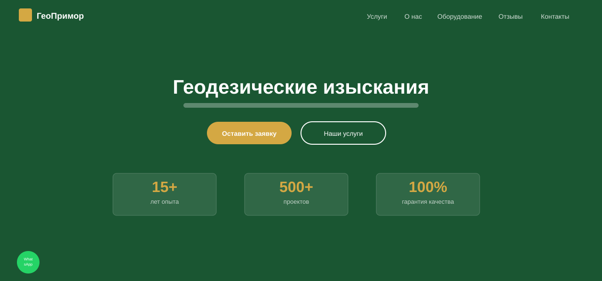

**Реализация:**

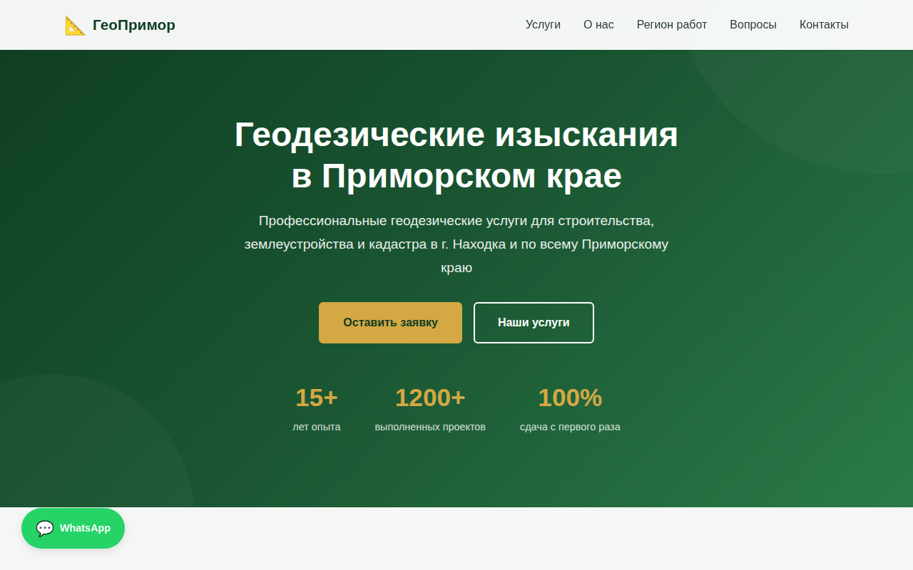

---

## 2. Услуги (Services)

Сетка из 6 карточек услуг: топографическая съёмка, межевание участков, кадастровые работы, инженерные изыскания, вынос границ в натуру, геодезический контроль.

**Эскиз:**

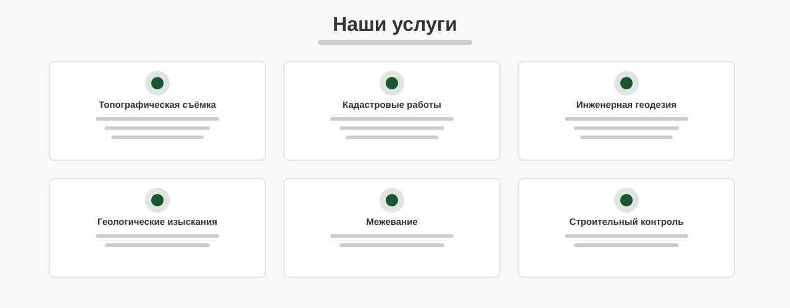

**Реализация:**

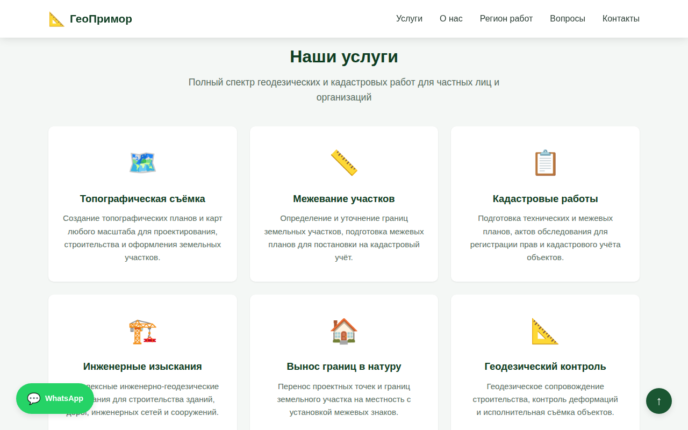

---

## 3. Этапы работы (Process)

Пошаговый визуальный процесс из 5 этапов: заявка → договор → полевые работы → обработка → сдача результатов.

**Эскиз:**

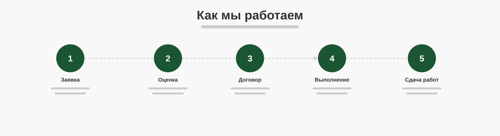

**Реализация:**

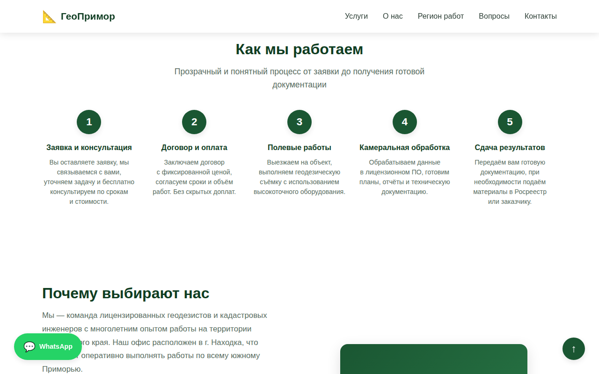

---

## 4. О компании (About)

Секция «Почему выбирают нас» с четырьмя преимуществами: лицензии и допуски, современное оборудование, точные сроки, прозрачные цены. Справа — визуальный блок-заглушка.

**Эскиз:**

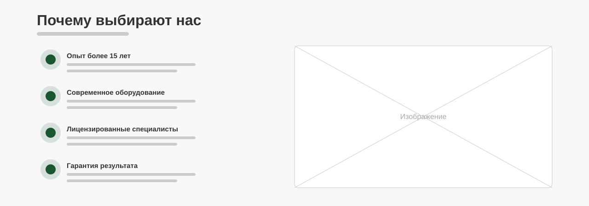

**Реализация:**

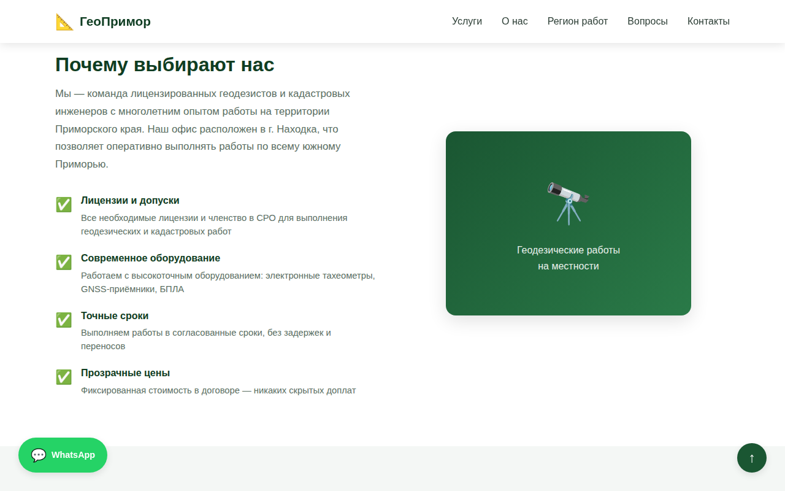

---

## 5. Оборудование (Equipment)

Сетка из 4 карточек с описанием используемого оборудования: GNSS-приёмники, электронные тахеометры, дроны для аэросъёмки, лицензионное ПО.

**Эскиз:**

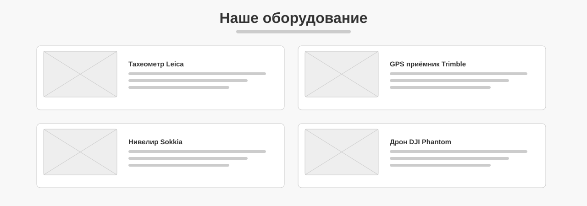

**Реализация:**

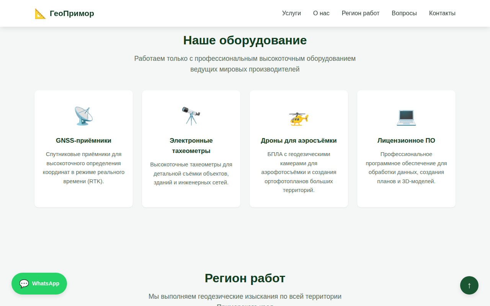

---

## 6. Регион работ (Area)

Сетка из 6 карточек с городами обслуживания: Находка (главный офис, выделена), Владивосток, Артём, Уссурийск, Партизанск, весь Приморский край.

**Эскиз:**

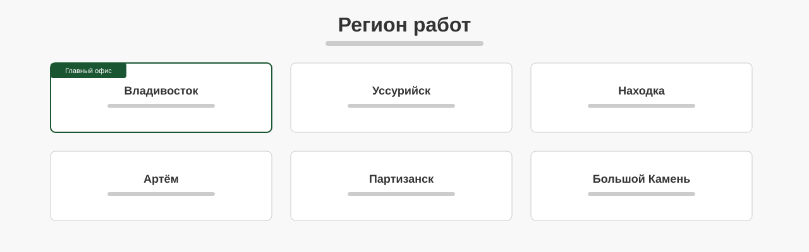

**Реализация:**

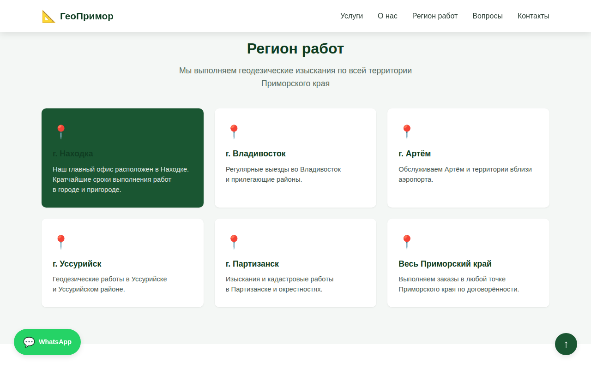

---

## 7. Отзывы клиентов (Testimonials)

Три карточки с отзывами: звёздный рейтинг, текст отзыва, аватар и имя автора с указанием города/компании.

**Эскиз:**

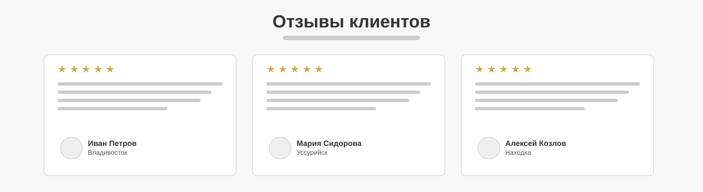

**Реализация:**

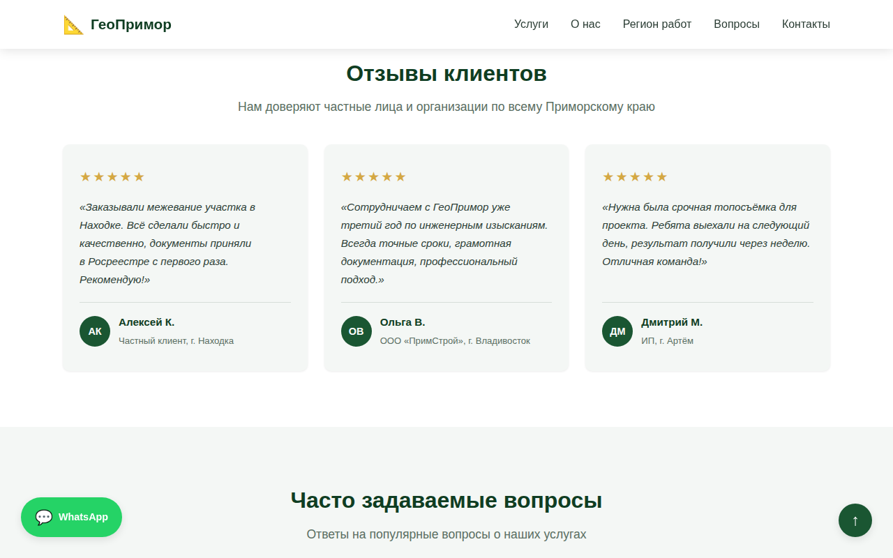

---

## 8. Часто задаваемые вопросы (FAQ)

Аккордеон из 6 вопросов и ответов: стоимость, сроки, документы для межевания, работа с юрлицами, допуск СРО, выезд за пределы Находки.

**Эскиз:**

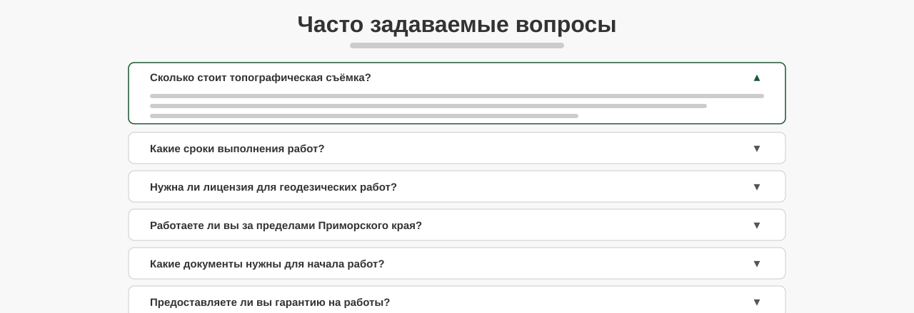

**Реализация:**

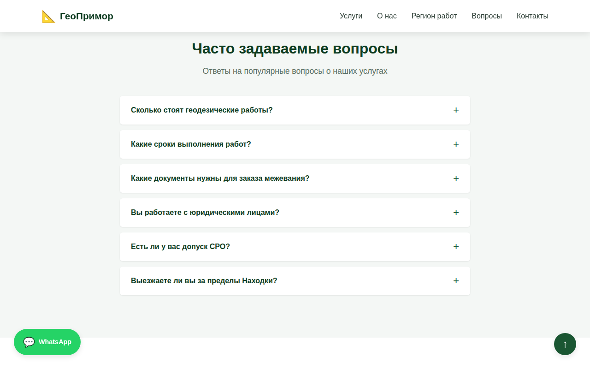

---

## 9. Контакты (Contact)

Контактная информация слева (телефон, e-mail, адрес, режим работы) и форма заявки справа (имя, телефон, e-mail, выбор услуги, сообщение).

**Эскиз:**

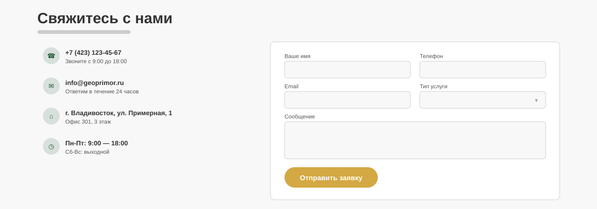

**Реализация:**

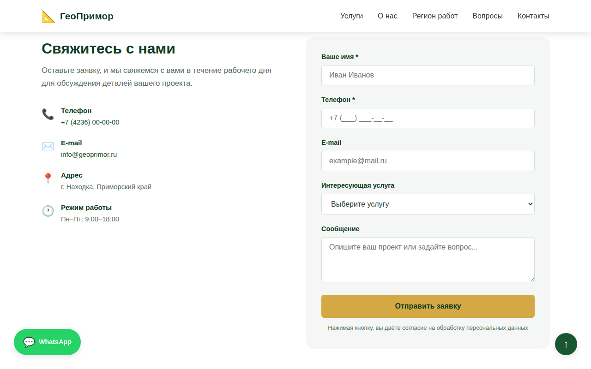

---

## 10. Подвал (Footer)

Тёмный подвал с логотипом, ссылками на услуги, навигацией по разделам и копирайтом. Кнопка «Наверх» в правом нижнем углу.

**Эскиз:**

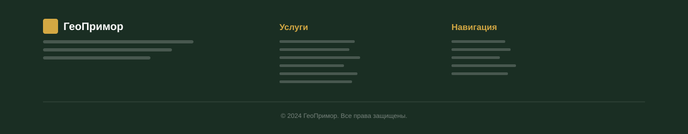

**Реализация:**

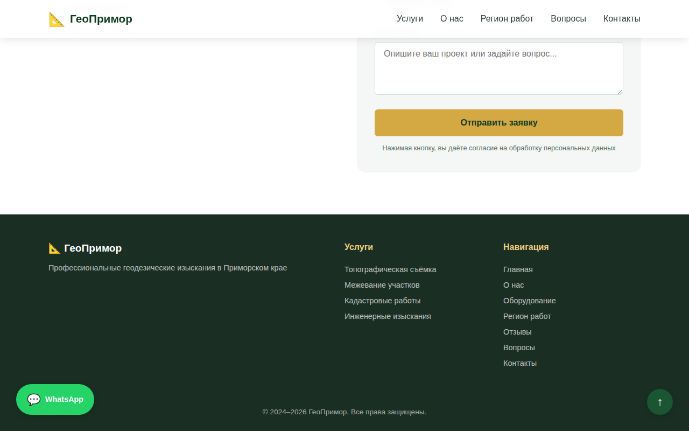

---

## 11. Мобильная версия

Адаптивный дизайн для мобильных устройств (375px). Бургер-меню, одноколоночная раскладка, адаптированные кнопки.

**Эскиз:**

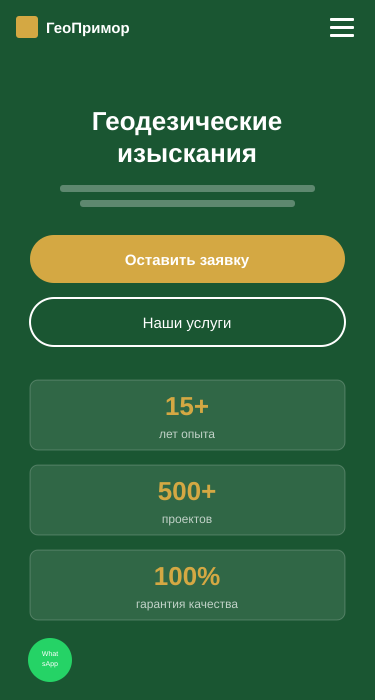

**Реализация:**

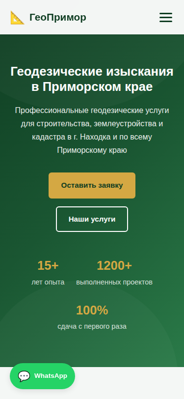

---

## 🎨 Дизайн-система

| Элемент | Значение |
|---------|----------|
| **Основной цвет** | `#1a5632` (тёмно-зелёный) |
| **Акцентный цвет** | `#d4a843` (золотой) |
| **Фон** | `#ffffff` / `#f4f7f5` |
| **Тёмный фон** | `#1a2e23` |
| **Шрифт** | Segoe UI, Helvetica Neue, Arial |
| **Скругления** | 6px / 10px / 16px |
| **Анимации** | fade-in при прокрутке, hover-эффекты |
